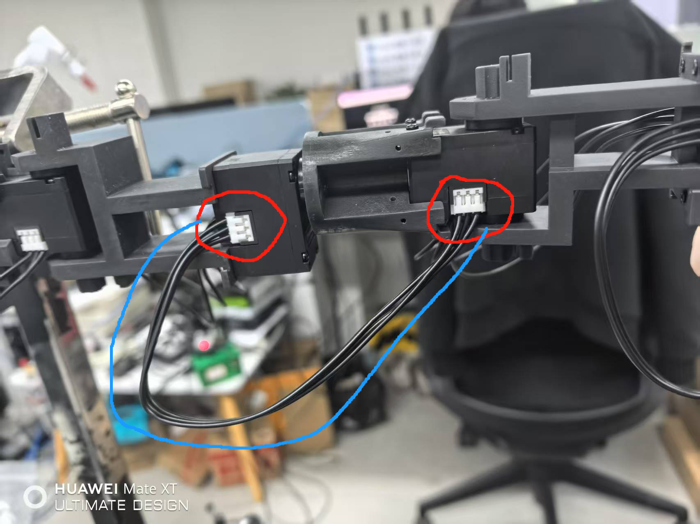
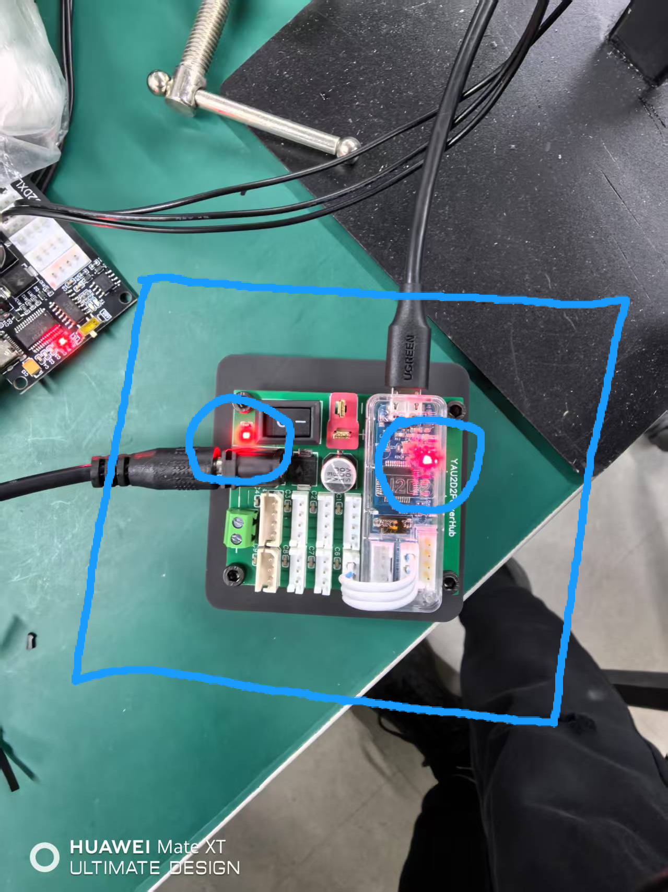

# adora-robot

[ [English](./README.md) | 中文 ]

项目网站(暂无) 

## 快速开始

### 硬件准备

adora机器人如下图。

其领导臂（遥操臂）如下图

请检查其线束是否连接正常或发生了缠绕。如下图所示，红色圈内为线束连接处，两红色圈之间的黑色连接线应当和蓝色线一样能够在两个红色圈之间形成一道弧线。

#### 启动并正常上电

开关位于adora机器人底盘后方蓝色圈内，如下图。

确认领导臂双臂的供电正常。需要确认两块如下图所示的控制板上的供电灯和信号灯都亮

#### 确保 跟随臂 活动空间安全

请确保机械臂（跟随臂）在下面图中，绿色圈出的范围内无障碍物

#### 确保 领导臂 处于校准/初始位置

<s>领导臂（遥操臂）在首次启动时，需要校准。需要将其变为如下图所示。

已经校准过的领导臂无需去到校准位置，而是去到初始位置。</s>

校准位置如下图所示。（需要双臂都如图所示）（启动时需要保持在该位置）（需确保铁标签的一面朝上）

#### 为Jetson Orin NX连接外围设备

Orin NX 需要连接显示器、键盘、鼠标、电源

### 使用注意事项

注意在遥操作时不要快速大幅度移动，不要让双臂碰撞自身。

双臂协同操作（双手靠拢时），遥操作人员需确保视线无遮挡，同时缓慢操作，避免双手发生碰撞。

### 启动软件

#### 系统启动并登录

启动Jetson Orin NX，登录密码为：`dora123`

<!-- #### 首次启动校准

#### 两种模式下不同起始位置 -->

#### 启动数据采集

登录系统后，可在浏览器访问`localhost:7878`进入数据采集系统。

### 数据采集系统使用

## 常见故障与解决方案

### 机械臂报警

一般是由于机械臂运动速度或加速度大于限制导致，重启机械臂后再重新启动程序即可。